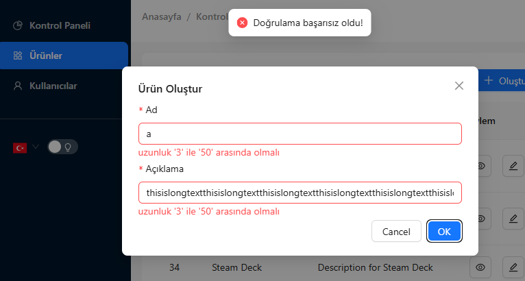
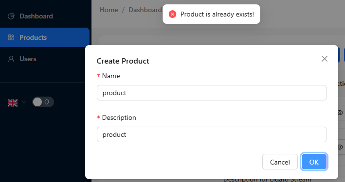

# API Response Standardization with Spring Boot & React

An example of standardized API responses, internationalized exception handling, and frontend integration using Spring Boot backend with React frontend.

## Features

- **Standardized API Responses**: Consistent response structure across all endpoints
- **Internationalization (i18n)**: Multi-language support with automatic locale detection
- **Exception Handling**: Centralized exception management with custom business error codes
- **Validation Error Handling**: Structured validation error responses
- **Request Tracing**: Unique trace IDs for request tracking and debugging
- **Frontend Integration**: Axios interceptor for automatic language header sending and error handling

## Response Structure

### Success Response
```json
{
    "error": false,
    "traceId": "683d9f681a57db4ef3e5aa046856dfb7",
    "message": "Operation successfully completed",
    "data": {
        "id": 1,
        "email": "johndoe@example.com"
    }
}
```

### Paginated Response
```json
{
    "error": false,
    "traceId": "683d9f681a57db4ef3e5aa046856dfb7",
    "message": "Data retrieved successfully",
    "data": {
        "content": [
            {
                "id": 1,
                "email": "johndoe@example.com"
            }
        ],
        "pageable": {
            "totalElements": 1,
            "numberOfElements": 1,
            "totalPages": 1,
            "last": true,
            "first": true,
            "empty": false
        }
    }
}
```

### Error Response
```json
{
    "error": true,
    "traceId": "683d9f681a57db4ef3e5aa046856dfb7",
    "businessErrorCode": 1004,
    "message": "You have validation errors!",
    "validationErrors": {
        "field1": "error1",
        "field2": "error2"
    }
}
```

- turkish
  
- english
  

## Backend Implementation

### Controller Example

Controllers use the standardized `ApiResponse` wrapper to ensure consistent response formatting:

```java
@RestController
@RequestMapping("/api/v1/products")
@RequiredArgsConstructor
@Tag(name = "Product Management", description = "APIs for creating, reading, updating, and deleting system products.")
public class ProductController {

    private final ProductService productService;

    @Operation(summary = "Create a new product", description = "Creates a new product.")
    @ApiResponses({
            @ApiResponse(responseCode = "201", description = "Product created successfully.", content = @Content(schema = @Schema(implementation = ProductCreateResponse.class))),
            @ApiResponse(responseCode = "400", description = "Invalid request body.", content = @Content(schema = @Schema(implementation = ApiResponseWrapper.class)))
    })
    @PostMapping
    public ResponseEntity<ApiResponse<ProductDto>> createProduct(@Valid @RequestBody ProductCreateRequest request) {
        var createdProduct = productService.createProduct(request);
        return ResponseEntity.status(HttpStatus.CREATED).body(ApiResponse.success(createdProduct));
    }

  @Operation(summary = "Get all products with filtering and pagination", description = "Retrieves a paginated list of products based on filter criteria.")
  @ApiResponses({
          @ApiResponse(responseCode = "200", description = "Successfully retrieved list of products.", content = @Content(schema = @Schema(implementation = ProductPageResponse.class)))
  })
  @GetMapping
  public ResponseEntity<ApiResponseWrapper<PageableResponse<ProductDto>>> getAllLookups(
          @ParameterObject @Valid ProductFilterRequest filter) {
    Page<ProductDto> productsPage = productService.getAllProducts(filter);
    return ResponseEntity.ok(ApiResponseWrapper.success(productsPage));
  }
    
}

// --- OpenAPI Schema Helpers in same Class ---

@Schema(name = "ProductCreateResponse", description = "API response containing a single product object.")
public static class ProductCreateResponse extends ApiResponseWrapper<ProductDto> {
}

@Schema(name = "ProductPageResponse", description = "API response containing a paginated list of product objects.")
public static class ProductPageResponse extends ApiResponseWrapper<PageableResponse<ProductDto>> {
}

/// ///////////////////////////
// --- Filter Request Class ---
////////////////////////////  
@Data
@EqualsAndHashCode(callSuper = true)
public class LookupFilterRequest extends BaseFilterRequest {
  @Schema(description = "Filter by lookup code (case-insensitive partial match).", example = "STATUS")
  private String code;

  @Schema(description = "Filter by a specific lookup type.", example = "GROUP")
  private LookupType lookupType;

  @Schema(description = "Filter by active status.", example = "true")
  private Boolean isActive;
}


@Data
@AllArgsConstructor
@NoArgsConstructor
@EqualsAndHashCode
public class BaseFilterRequest {

  @Schema(description = "Page number (starts from 0)", example = "0")
  @NotNull
  @Min(0)
  @Max(99999)
  private int page = 0;

  @Schema(description = "Number of records per page", example = "30")
  @NotNull
  @Min(1)
  @Max(150)
  @Positive
  private int size = 30;

  @Schema(description = "Sort direction", example = "desc", allowableValues = {"asc", "desc"})
  @Pattern(regexp = "^(asc|desc)$", message = "{sort.direction.pattern.exception}")
  private String sortDir = "desc";

  @Schema(description = "Sort by field", example = "createdAt")
  private String sortBy = "createdAt";

  @Schema(description = "Filter entity created after this date", example = "2024-01-01")
  @JsonFormat(shape = JsonFormat.Shape.STRING, pattern = "yyyy-MM-dd")
  private LocalDate startDate;

  @Schema(description = "Filter entity created before this date", example = "2028-12-31")
  @JsonFormat(shape = JsonFormat.Shape.STRING, pattern = "yyyy-MM-dd")
  private LocalDate endDate;


  public Sort.Direction getSortDir() {
    return this.sortDir.equalsIgnoreCase("asc") ? Sort.Direction.ASC : Sort.Direction.DESC;
  }

}
```

### Global Exception Handler

The `@RestControllerAdvice` centralizes exception handling and ensures all errors follow the standardized response format:

```java
@Hidden // for openapi doc
@Slf4j
@RestControllerAdvice
public class GlobalExceptionHandler {

    @ExceptionHandler({BusinessException.class})
    public ResponseEntity<ApiResponseWrapper<Object>> handleCustomException(BusinessException exception) {
        log.warn("Business exception occurred: {}", exception.getMessage());
        ApiResponseWrapper<Object> response = ApiResponseWrapper.error(
                exception.getBusinessErrorCode(),
                exception.getMessage(),
                null);
        return new ResponseEntity<>(response, exception.getStatus());
    }
  ...
}
```

### Exception Message Enum

The `ExceptionMessage` enum centralizes all exception definitions with their corresponding HTTP status codes and business error codes:

```java
@Getter
public enum ExceptionMessage {
    DEFAULT_EXCEPTION("messages.error.default_message", HttpStatus.BAD_REQUEST, 1000),
    ALREADY_EXISTS_EXCEPTION("messages.error.already_exists_exception", HttpStatus.CONFLICT, 1001),
    PRODUCT_NOT_FOUND_EXCEPTION("messages.error.product_not_found_exception", HttpStatus.NOT_FOUND, 1002);

    private final String key;
    private final HttpStatus status;
    private final int businessErrorCode;

    ExceptionMessage(String key, HttpStatus httpStatus, int businessErrorCode) {
        this.key = key;
        this.status = httpStatus;
        this.businessErrorCode = businessErrorCode;
    }
}
```

### Usage Examples

**Validation Check:**
```java
if (productRepository.existsByNameIgnoreCase(productRequest.name())) {
    throw buildException(ExceptionMessage.ALREADY_EXISTS_EXCEPTION);
}
```

**Entity Retrieval:**
```java
public Product getProduct(Long id) {
    return productRepository.findById(id)
            .orElseThrow(() -> buildException(ExceptionMessage.PRODUCT_NOT_FOUND_EXCEPTION, id));
}
```

### Internationalization Configuration

The `MessageConfig` handles locale resolution based on the `Accept-Language` header:

```java
@Configuration
public class MessageConfig implements WebMvcConfigurer {

  @Bean
  public LocaleResolver localeResolver() {
    return new AcceptHeaderLocaleResolver() {
      @Override
      @NonNull
      public Locale resolveLocale(@NonNull HttpServletRequest request) {
        String acceptLanguageHeader = request.getHeader("Accept-Language");
        return acceptLanguageHeader != null
                ? Locale.forLanguageTag(acceptLanguageHeader)
                : Locale.of("tr", "TR");
      }
    };
  }
}

@Component
public class MessageUtil {

  private static MessageSource messageSource;

  public MessageUtil(MessageSource messageSource) {
    MessageUtil.messageSource = messageSource;
  }

  public static String getMessage(String key, Object[] args) {
    try {
      return messageSource.getMessage(key, args, LocaleContextHolder.getLocale());
    } catch (Exception e) {
      return messageSource.getMessage("messages.fallback", null, LocaleContextHolder.getLocale());
    }
  }

  public static String getMessage(String key) {
    return getMessage(key, null);
  }

}
```

## Frontend Integration

### Axios Interceptor

The React frontend automatically sends the user's preferred language in API requests:

```javascript
axiosInstance.interceptors.request.use(
    (config) => {
        const language = useUIStore.getState().language;
        if (language) {
            config.headers['Accept-Language'] = language;
        }
        return config;
    },
    (error) => Promise.reject(error)
);
```

## Project Structure

```
├── backend/
│   ├── src/main/java/
│   │   ├── config/
│   │   │   └── MessageConfig.java
│   │   ├── controller/
│   │   │   └── ProductController.java
│   │   ├── enums/
│   │   │   └── ExceptionMessage.java
│   │   ├── exception/
│   │   │   ├── BusinessException.java
│   │   │   └── GlobalExceptionHandler.java
│   │   ├── dto/
│   │   │   ├── ProductDto.java
│   │   │   ├── ProductCreateRequest.java
│   │   │   └── ApiResponse.java
│   │   └── service/
│   │       └── ProductService.java
│   └── src/main/resources/
│       ├── messages.properties
│       └── messages_tr.properties
└── frontend/
    ├── src/
    │   ├── interceptors/
    │   │   └── axiosInterceptor.js
    │   └── store/
    │       └── uiStore.js
    └── package.json
```

## Configuration

### Message Properties Files

Create message property files for different languages:

**messages.properties (default)**
```properties
messages.error.default_message=An error occurred
messages.error.already_exists_exception=Resource already exists
messages.error.not_found_exception=Record with id {0} not found!
```

**messages_tr.properties**
```properties
messages.error.default_message=Bir hata oluştu
messages.error.already_exists_exception=Kaynak zaten mevcut
messages.error.not_found_exception={0} idli kayıt bulunamadı!
```

### ApiResponse Wrapper Class

The standardized response wrapper ensures all API responses have the same structure:

```java
@JsonPropertyOrder({
        "error",
        "traceId",
        "businessErrorCode",
        "message",
        "data",
        "validationErrors",
})
@JsonInclude(JsonInclude.Include.NON_NULL)
@Data
@Builder
@NoArgsConstructor
@AllArgsConstructor
public class ApiResponseWrapper<T> {

  // Define the default message keys
  private static final String DEFAULT_SUCCESS_KEY = "messages.default.success";
  private static final String DEFAULT_ERROR_KEY = "messages.default.error";

  // Common fields
  private Boolean error;
  private String message;
  @Builder.Default
  private String traceId = MDC.get("traceId");

  // Success response field
  private T data;

  // Error response fields
  private Integer businessErrorCode;
  private Map<String, String> validationErrors;

  public static <T> ApiResponseWrapper<T> success(T data) {
    return success(data, DEFAULT_SUCCESS_KEY);
  }

  public static <T> ApiResponseWrapper<T> success(T data, String messageKey) {
    return ApiResponseWrapper.<T>builder()
            .error(false)
            .message(MessageUtil.getMessage(messageKey))
            .data(data)
            .build();
  }

  public static <U> ApiResponseWrapper<PageableResponse<U>> success(Page<U> page) {
    return success(page, DEFAULT_SUCCESS_KEY);
  }

  public static <U> ApiResponseWrapper<PageableResponse<U>> success(Page<U> page, String messageKey) {
    PageableResponse.PageDetails pageDetails = PageableResponse.PageDetails.builder()
            .totalElements(page.getTotalElements())
            .numberOfElements(page.getNumberOfElements())
            .totalPages(page.getTotalPages())
            .last(page.isLast())
            .first(page.isFirst())
            .empty(page.isEmpty())
            .build();

    PageableResponse<U> pageableResponse = PageableResponse.<U>builder()
            .content(page.getContent())
            .pageable(pageDetails)
            .build();

    return ApiResponseWrapper.<PageableResponse<U>>builder()
            .error(false)
            .message(MessageUtil.getMessage(messageKey))
            .data(pageableResponse)
            .build();
  }

  public static ApiResponseWrapper<Object> successWithEmptyData() {
    return successWithEmptyData(DEFAULT_SUCCESS_KEY);
  }

  public static ApiResponseWrapper<Object> successWithEmptyData(String messageKey) {
    return ApiResponseWrapper.builder()
            .error(false)
            .message(MessageUtil.getMessage(messageKey))
            .data(null)
            .build();
  }

  public static ApiResponseWrapper<Object> error(Integer businessErrorCode, Map<String, String> validationErrors) {
    return error(DEFAULT_ERROR_KEY, businessErrorCode, validationErrors);
  }

  public static ApiResponseWrapper<Object> error(String messageKey, Integer businessErrorCode,
                                                 Map<String, String> validationErrors) {
    return ApiResponseWrapper.builder()
            .error(true)
            .message(MessageUtil.getMessage(messageKey))
            .businessErrorCode(businessErrorCode)
            .validationErrors(validationErrors)
            .build();
  }

  public static ApiResponseWrapper<Object> error(Integer businessErrorCode, String customMessage,
                                                 Map<String, String> validationErrors) {
    return ApiResponseWrapper.builder()
            .error(true)
            .message(customMessage)
            .businessErrorCode(businessErrorCode)
            .validationErrors(validationErrors)
            .build();
  }

}
```
